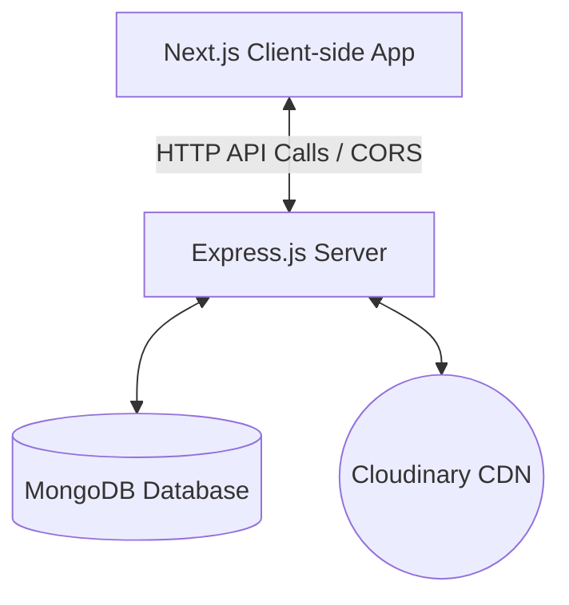

# 🚀 CareerHub - Professional Networking & Job Portal

**🔗 Live Demo:** [career-hub-three-kappa.vercel.app](https://career-hub-three-kappa.vercel.app/)

CareerHub is a premium, full-stack professional networking and job search platform. Built using **Next.js 16 (React 19)** on the frontend and **Node.js/Express** on the backend, it enables users to build professional profiles, upload resumes, connect with other professionals, create posts/articles, and search & apply for jobs.

---

## 🛠️ Technology Stack

### Frontend
- **Framework:** Next.js 16 (React 19, App Router)
- **State Management:** Redux Toolkit (`@reduxjs/toolkit` & `react-redux`)
- **Styling:** TailwindCSS v4 & Vanilla CSS (with support for Dark Mode using `next-themes`)
- **Icons & Notifications:** Lucide React & React Toastify
- **Language:** TypeScript

### Backend
- **Runtime & Server:** Node.js, Express (ES Modules)
- **Database:** MongoDB Atlas (Mongoose ODM)
- **File Uploads:** Multer & Cloudinary Storage
- **Document Generation:** PDFKit & PDF Creator Node (for resume generation)
- **Security:** Bcrypt (Password hashing)

---

## ⚙️ Architecture Overview



---

## 🚀 Getting Started (Local Development)

Follow these steps to set up the project locally:

### Prerequisites
- Node.js (v18 or higher recommended)
- MongoDB instance (Local or Atlas)
- Cloudinary Account (for image/resume uploads)

---

### 1. Backend Setup

1. Navigate to the `backend` directory:
   ```bash
   cd backend
   ```
2. Install dependencies:
   ```bash
   npm install
   ```
3. Create a `.env` file from the example:
   ```bash
   copy .env.example .env
   ```
4. Update the environment variables in `.env` with your credentials:
   ```env
   MONGO_URI=mongodb+srv://<username>:<password>@cluster.mongodb.net/Social
   CLOUDINARY_CLOUD_NAME=your_cloud_name
   CLOUDINARY_API_KEY=your_api_key
   CLOUDINARY_API_SECRET=your_api_secret
   FRONTEND_URL=http://localhost:3000
   PORT=9090
   ```
5. Start the development server (runs on `http://localhost:9090` by default):
   ```bash
   npm run dev
   ```

---

### 2. Frontend Setup

1. Navigate to the `frontend` directory:
   ```bash
   cd ../frontend
   ```
2. Install dependencies:
   ```bash
   npm install
   ```
3. Create a `.env` file from the example:
   ```bash
   copy .env.example .env
   ```
4. Set the backend API URL:
   ```env
   NEXT_PUBLIC_API_URL=http://localhost:9090
   ```
5. Run the frontend development server (runs on `http://localhost:3000` by default):
   ```bash
   npm run dev
   ```

---

## 🌐 Production Deployment

This project is configured to use environment variables for CORS, backend server binding, and frontend API endpoints, making it ready for production.

### Backend Deployment (Render, Heroku, Railway)
Configure the following Environment Variables in your hosting dashboard:
- `MONGO_URI`: Connection string to MongoDB Atlas.
- `FRONTEND_URL`: The deployed domain of your frontend (e.g., `https://careerhub-client.vercel.app`) - **used for CORS safety**.
- `PORT`: (Optional) The host will inject this automatically.
- Cloudinary credentials (`CLOUDINARY_CLOUD_NAME`, `CLOUDINARY_API_KEY`, `CLOUDINARY_API_SECRET`).

> [!NOTE]
> The backend `package.json` includes a `"start": "node server.js"` script, which is automatically recognized by most deployment providers.

### Frontend Deployment (Vercel, Netlify)
Configure the following Environment Variable in your Vercel/Netlify project:
- `NEXT_PUBLIC_API_URL`: The URL of your deployed backend (e.g., `https://careerhub-api.onrender.com`).

> [!IMPORTANT]
> Next.js replaces `NEXT_PUBLIC_` environment variables **at build time**. Ensure this variable is configured **before** triggering the production build.

---

## 📦 Key Directory Structure

```text
CareerHub/
├── backend/
│   ├── config/          # Database & Cloudinary configurations
│   ├── routes/          # API route definitions (user, job, posts)
│   ├── server.js        # Main server entrypoint (Express setup)
│   ├── package.json     # Node.js dependencies & scripts
│   └── .env.example     # Template for Backend environment variables
│
├── frontend/
│   ├── app/             # Next.js App Router pages (Home, Jobs, Profiles)
│   ├── components/      # Reusable UI Components
│   ├── utils/           # Helper scripts & API communication client
│   ├── store/           # Redux state slice definitions
│   ├── package.json     # Next.js scripts & dependencies
│   └── .env.example     # Template for Frontend environment variables
```
